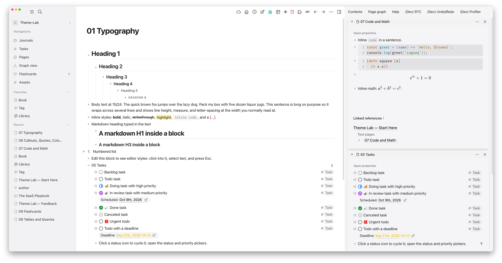
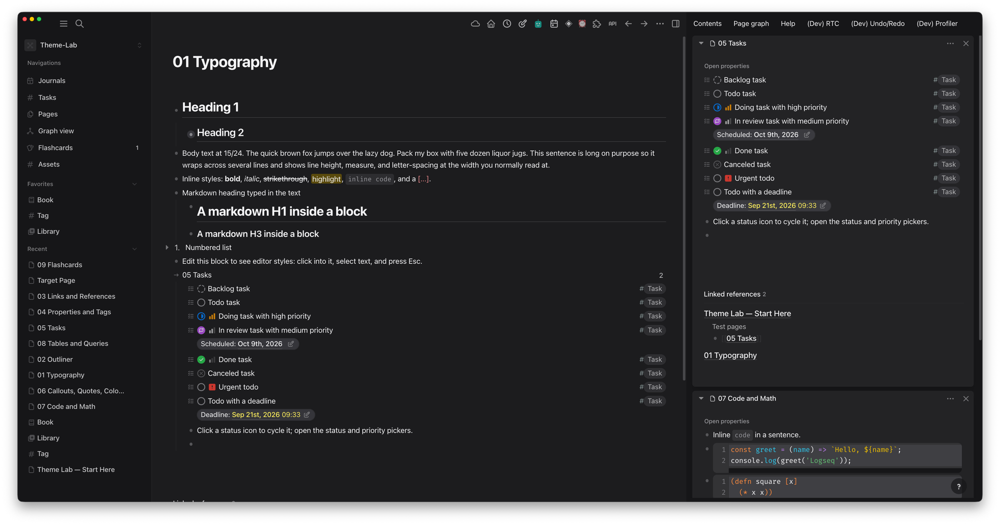
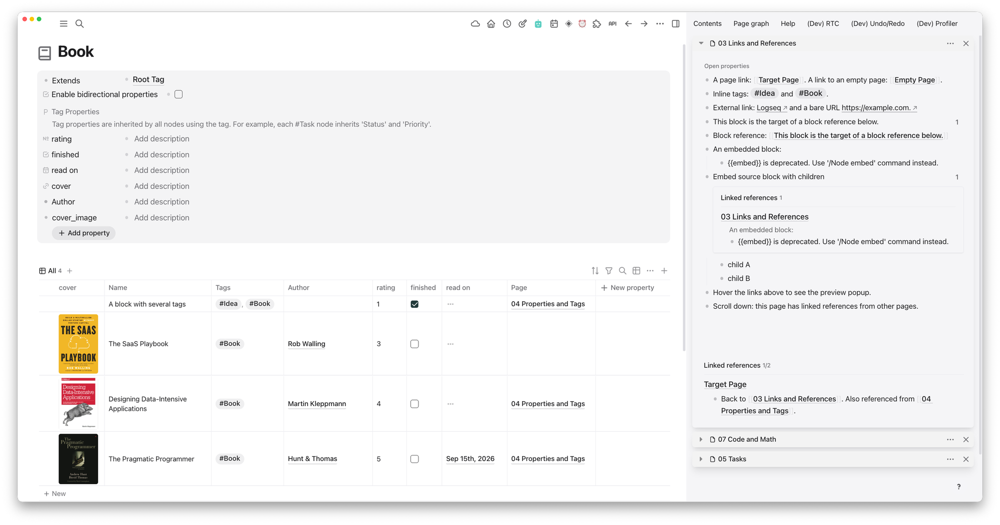
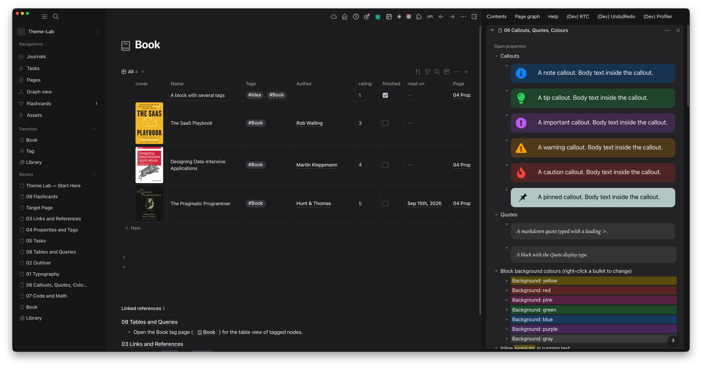
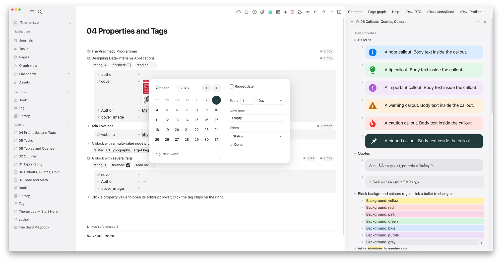

# Inkwell — a Logseq DB theme

Quiet, ink-toned themes for Logseq DB graphs. Each variant comes in light and dark, follows Logseq's own theme switch, and holds whichever accent colour is picked in Settings.

| | Light | Dark |
|---|---|---|
| **Typography and tasks** |  |  |
| **Tables** |  |  |
| **Properties and callouts** |  | |

| Variant   | Palette                                                                         |
| --------- | ------------------------------------------------------------------------------- |
| **Slate** | Deep slate (`#223B3B`) and one oxblood accent (`#9C2529`) on Apple system greys |

More variants (blue, monochrome) are planned; see [docs/DESIGN.md](docs/DESIGN.md#adding-a-variant).

## Compatibility

- **DB graphs only**, Logseq 2.0.x, desktop and web. File-based graphs use different markup and are not supported.
- Checked against Logseq master `9c18a5432b` and live on Logseq 2.0.1, web and desktop: automated style checks in light, dark and four accent colours, plus a full human review pass in the desktop app.

## Install

**As a plugin theme.** Once published, install _Inkwell theme_ from the Marketplace › Themes, then pick a variant, e.g. **Inkwell Slate Light** or **Inkwell Slate Dark**. To load a local checkout, turn on Developer mode, then Plugins › Load unpacked plugin › choose this folder.

**As custom.css.** Settings › General › Custom theme › Edit custom.css, paste the whole of one variant file, e.g. [`themes/inkwell-slate.css`](themes/inkwell-slate.css), and save. One file styles both light and dark mode.

## What it covers

- The three variable layers Logseq reads: shui/Tailwind HSL tokens, the `--lx-gray-*` / `--lx-accent-*` scales, and the classic `--ls-*` variables.
- **Editor:**
  - page title, H1–H6, bullets and guide lines
  - links, tags, block references, properties
  - highlights and the 7 block background colours
  - callouts (NOTE/TIP/IMPORTANT/WARNING/CAUTION, and PINNED as a Decision callout)
  - quotes, code, task status and priority icons
  - images and videos: images without a saved size show at 640px, default-sized videos fill the block; resized media keep their size
  - tag chips stay beside the block title in hover previews and narrow panels
- **App surfaces:** left sidebar, command palette, dialogs, popovers and menus (with a visible hover and selection highlight), date picker, buttons, inputs, shortcut keycaps.
- **Table views:** long titles wrap and rows grow to fit, including rows with cover images; row separators stay visible at any app zoom.
- **Flashcards:** rating buttons in the usual colours (Again red, Hard orange, Good green, Easy blue).

## Layout

```
src/base.css              shared rules for every variant: variable mapping + components (no colours)
src/palettes/<id>.css     one palette per variant (--ink-* tokens, light + dark)
build.mjs                 palette + base → themes/inkwell-<id>.css, and registers themes in package.json
themes/inkwell-<id>.css   generated; the file Logseq loads (commit it)
```

Logseq loads one stylesheet per theme, and custom.css can't import files, so each variant ships as a single generated file.

## Develop

```sh
npm run build                          # regenerate themes/ and package.json after editing src/
npm test                               # structural tests; also fails if themes/ is stale
npm run lab                            # build the Theme-Lab test graph and open it in Logseq-DB.app
npm run lab -- --variant slate         # pick the variant to test
npm run lab -- --rebuild               # recreate the graph (wipes feedback: snapshot first)
npm run lab:feedback                   # snapshot the Theme-Lab feedback page into feedback/<date>.md (git-ignored)
npm run package                        # build the marketplace zip into dist/
```

CI runs `npm test` on every push. Pushing a tag `vX.Y.Z` (matching `package.json`) builds the zip and attaches it to a GitHub release.

The lab needs the `logseq` CLI (installed by the desktop app) and Python 3. How to test a change: [docs/TESTING.md](docs/TESTING.md). Cutting a release: [docs/RELEASE.md](docs/RELEASE.md). Open work: [TASKS.md](TASKS.md).

## License

MIT © Danzu
